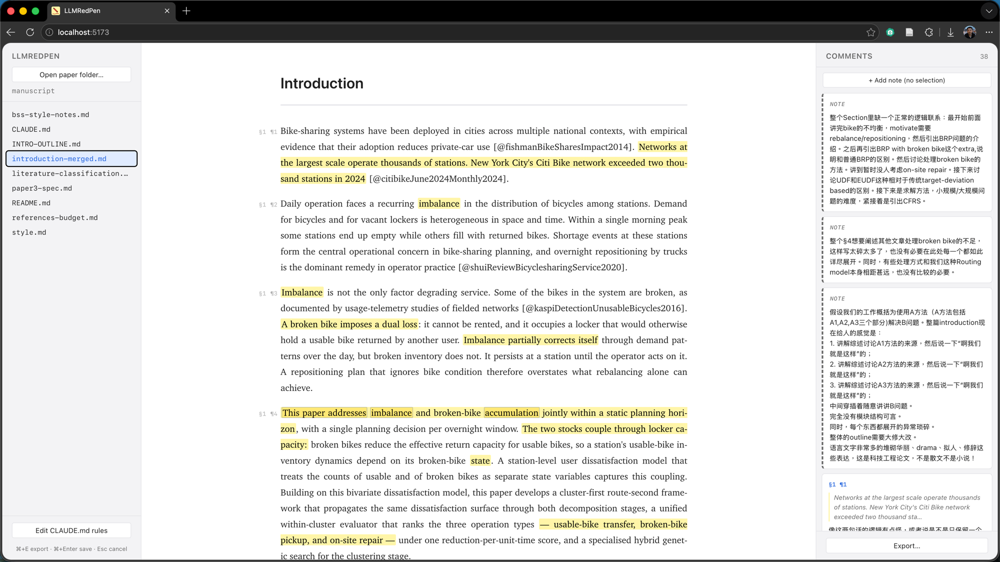
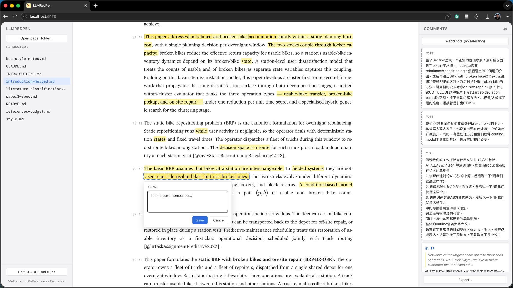
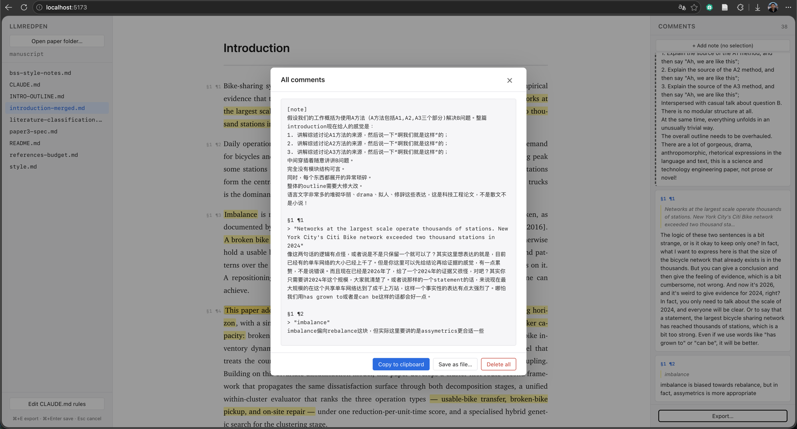
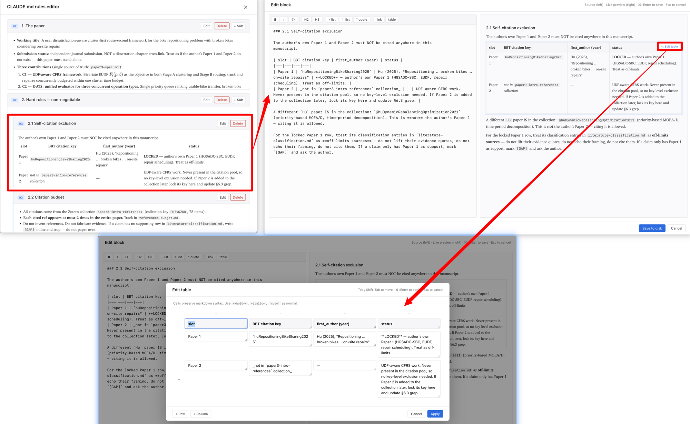

# LLMRedPen

A small browser-based tool for reviewing the long-form Markdown a
language model just wrote you — highlighting passages, attaching
comments, and exporting the whole batch back to the model in one block.

The aim is to bring the rhythm of paper review — careful reading, red-pen
margins, then handover to the author — into LLM-assisted writing, without
turning the user into a full-time editor.



---

## Table of contents

- [Why this tool exists](#why-this-tool-exists)
- [Screenshots](#screenshots)
- [What it does](#what-it-does)
- [Requirements](#requirements)
- [Install](#install)
- [Usage](#usage)
- [Working with an LLM agent](#working-with-an-llm-agent)
- [How it works](#how-it-works)
- [Known limitations](#known-limitations)
- [Roadmap](#roadmap)
- [Project layout](#project-layout)
- [License](#license)

---

## Why this tool exists

Working with LLMs on long-form writing has settled into a familiar loop:
paste a lot of text, get a lot of text back, scroll past most of it,
send the next message. The pile of unreviewed output snowballs. What
was meant to be a collaboration drifts into one party writing and the
other party tolerating.

The user isn't lazy. The reviewer's chair just isn't there.

**Markdown reads like a note, not a manuscript.** Heading hashes,
citation tokens, hard-wrapped lines, embedded comments — even rendered
in Typora or a VS Code preview, a Markdown draft feels like an informal
write-up, not a paper to focus on. There is no "I am reading a
manuscript" mode that invites careful reading.

**Markdown has no native annotation surface.** PDFs have margin
comments; Word has tracked changes; rendered HTML pages have
Hypothesis. Markdown — the *lingua franca* of LLM interaction — has
none of this. So reviewers fall back to writing remarks in a side file:
open a notepad, switch back and forth, copy-paste line numbers, lose
their place. The friction is high enough that most people stop after a
few comments and just tell the model to "make it better."

**Without batched feedback, every comment becomes a separate turn.**
Reviewers send the model one observation at a time as they read,
interrupting it mid-thought and re-running its context for each
fragment. The model edits a little, the user reads a little more,
sends another fragment. The conversation thrashes without ever
converging. One mistake in the model's output can also trigger a
wholesale rejection — the user discards the entire revision over a
single bad sentence and starts over, instead of pointing at the
specific line.

`LLMRedPen` tries to be the missing reviewer's chair. It renders a
Markdown file in a document-like reading view, lets you highlight any
passage or comment on any paragraph, then exports every comment as a
single block of plain text. You paste it back to the LLM in **one**
message — a real review pass, not a stream of interruptions.

The deeper goal is to keep *you*, the human, reading what the LLM
wrote.

---

## Screenshots

<table>
<tr>
<td width="50%" valign="top">

**Annotating a paragraph**

Select any text → a popup opens, the selection stays highlighted
(dashed orange) while you type, and saving turns it into a permanent
yellow mark with a matching card on the right.



</td>
<td width="50%" valign="top">

**Batch export**

Every comment, in document order, in plain text. Copy to clipboard or
save as a file — one block to paste back to your LLM.



</td>
</tr>
</table>

**Editing tables in the CLAUDE.md rules file**

Tables inside the writing-rules file are typically the worst part of
Markdown editing — pipe characters, alignment hyphens, hand-counting
columns. Hover any rendered table in the rules editor to reveal an
*Edit table* button; click it to drop into a visual grid where each
cell is an auto-growing textarea. Apply turns the grid back into clean
Markdown table syntax.



---

## What it does

- **Document-style rendering.** Renders Markdown (via markdown-it) with
  math (via KaTeX) in a justified, serif, paper-like layout. When a
  file uses only `###` headings in its body (the common "outline
  draft" shape), the outline labels are hidden so the prose flows as
  it would in the published version.
- **Three annotation modes:**
  - *Text selection* — select a passage, write a comment about that
    phrase.
  - *Paragraph-level* — click the `§S ¶N` marker in the margin to
    comment on a whole paragraph without selecting any text.
  - *General note* — file-wide remark, no anchor.
- **Right-hand comments pane** — every comment as a card. Click a card
  to scroll to the passage; hover to highlight the matching mark in
  the article. Edit / delete inline.
- **Batch export** — copy all comments to clipboard or save as a plain
  text file. The output is what you paste back to the model.
- **Round-based review loop** — three tabs above the article:
  *&larr; Prev* (last round's frozen version + the comments you sent),
  *&harr; Diff* (word-level changes since you locked the previous
  round), *Current &rarr;* (today's file, where you add new comments).
  When you're done with a pass, *Proceed to the next round* snapshots
  the current state as the new baseline. Only the previous round is
  kept — the tool isn't a version-control system.
- **Folder restore** — the chosen paper folder is remembered across
  refreshes; one click reopens it (Chromium permissions permitting).
- **CLAUDE.md rules editor** — the one file the tool writes back to
  disk. Each `##` / `###` block is a card with edit / add / delete
  actions; the editor has a Markdown toolbar, live preview, and a
  visual editor for tables (no more hand-editing `| col | col |`).

---

## Requirements

- **Browser:** Chromium-based (Chrome / Edge / Arc / Brave). The tool
  uses the [File System Access API](https://developer.mozilla.org/en-US/docs/Web/API/File_System_Access_API),
  which is not yet available in Firefox or fully in Safari.
- **Runtime:** [Bun](https://bun.sh). Only used for the tiny static
  server that serves the page — there is no backend.

---

## Install

```sh
git clone https://github.com/rqhu1995/LLMRedPen.git ~/tools/llm-redpen
```

(or clone anywhere; the paths below just assume `~/tools/llm-redpen`).

Optional shell alias — for fish:

```fish
# add to ~/.config/fish/conf.d/03-aliases.fish (or your shell config)
alias redpen='bun ~/tools/llm-redpen/server.ts'
```

---

## Usage

Start the server:

```sh
bun ~/tools/llm-redpen/server.ts
# or, with the alias:
redpen
```

Open <http://localhost:5173/> in a Chromium browser.

1. **Open a folder.** Click *Open paper folder…* and pick any
   directory containing `.md` files. The viewer renders them; nothing
   else on disk is touched. The only file the viewer ever writes back
   is `CLAUDE.md` (via the rules editor), and only when you explicitly
   save in that editor — `CLAUDE.md` does not need to exist up front.
2. **Read.** The left sidebar lists every `.md` file in the folder.
   Click one to render it. Each paragraph gets a `§S ¶N` anchor in
   the margin.
3. **Annotate.** Three ways:
   - Select text → comment popup → `⌘+Enter` to save.
   - Click a `§S ¶N` margin label → comment popup pre-anchored to
     that paragraph.
   - Click *+ Add note* in the right pane → unanchored remark.
4. **Navigate.** Hover a `mark` in the article to see the comment in
   a tooltip and highlight the matching card on the right. Click
   either side to scroll the other.
5. **Export.** *Export…* in the right pane gives you the full batch as
   plain text. *Copy to clipboard* or *Save as file…* (the file picker
   defaults to your paper folder).
6. **Hand off to the LLM.** Paste the *agent prompt* (see next
   section) followed by the exported comments. One message, one
   review pass.

### Hotkeys

| Key | Action |
|---|---|
| `⌘+Enter` (in comment popup) | Save the comment |
| `Esc` | Cancel popup / close modal |
| `⌘+E` | Open the export modal |
| `Tab` / `Shift+Tab` (in table editor) | Move between cells |

> Windows / Linux users: read `⌘` as `Ctrl` throughout — the UI labels
> are rewritten automatically on non-Mac platforms.

---

## Working with an LLM agent

The exported comments use anchors like `§1 ¶3` that don't exist in the
underlying Markdown source — they're computed by the viewer from
structural position. Before pasting your comments to the LLM, prepend
the *Annotation anchor format* prompt so the model knows how to map
anchors back to the file. The full prompt lives at
[`docs/agent-prompt.md`](docs/agent-prompt.md).

Workflow:

```
[Annotation anchor format prompt from docs/agent-prompt.md]

[Your exported comments block]

Please apply these comments to introduction-merged.md.
```

The model edits the source. Before you hand off to the model, click
*Proceed to the next round* — this snapshots the file + your
comments so the next time you reopen, the *Diff* tab shows exactly
what changed and the *Prev* tab shows what you sent. New comments go
on the new file; the previous round stays read-only as a record.

Organize side material into subfolders — `plans/` for writing-agent
intermediate plans, `rules/` for style guides and spec files,
`self-review/` for audit notes, anything else you want grouped. Each
immediate subfolder becomes its own labelled group in the sidebar.
Root `.md` files get the full round model (*Prev* / *Diff* /
*Current* + *Proceed*); subfolder files are annotatable + reloadable
but stay out of the round loop (no Prev/Diff, no Proceed). A one-time
*workflow setup* prompt for the writing agent — including the `plans/`
convention and the formatting constraints the viewer's reading-view
stripper expects — lives at
[`docs/agent-workflow.md`](docs/agent-workflow.md).

---

## How it works

- **Browser-first.** The viewer is a static page (`index.html` +
  `app.js` + `style.css`) served by a ~50-line Bun static server
  (`server.ts`). All file I/O is client-side through the File System
  Access API. The server has no knowledge of your manuscript.
- **Persistent annotations.** Comments live in `localStorage` keyed by
  folder name. The chosen folder handle lives in `IndexedDB` so a
  refresh offers one-click reopen.
- **Round model, not a VCS.** When you click *Proceed to the next
  round*, the current file content + this round's comments are
  snapshotted into a single previous-round slot. The *Prev* tab
  reads from that slot; the *Diff* tab compares it against the
  current file content (word-level diff via
  [jsdiff](https://github.com/kpdecker/jsdiff)). Only one previous
  round is kept — promoting again overwrites it. This keeps the
  storage model trivially small and avoids drifting into "version
  control inside a browser tab", which the tool deliberately is not.
- **Annotation locator (internal).** Highlights for current-round
  comments are placed by a four-layer locator (structural anchor →
  character offset → exact context → fuzzy context, modelled on
  [Hypothesis](https://github.com/hypothesis/client)). It's there to
  survive the small mid-session edits you might make before
  proceeding. Comments that fail to locate just don't draw a
  highlight; their cards still sit in the right pane with the stored
  quote so you can see what you wrote.
- **Dependencies.** markdown-it, KaTeX, jsdiff from a CDN; no npm
  install, no build step. Bun is only the static file server.

---

## Known limitations

- **Same quote, same context, multiple occurrences.** If the exact
  selected text and its prefix/suffix appear at more than one place
  in the file, the locator picks the candidate closest to the stored
  character offset. Without a position hint it picks the first hit,
  which may be the wrong one. (Hypothesis has the same caveat.)
- **Whole-paragraph rewrite.** If the LLM rewrites a passage past the
  point where the locator can find it, the comment's highlight just
  doesn't render — but the card still shows in the right pane with
  the stored quote. The intended workflow is *Proceed to the next
  round* before the agent edits, so each round's comments stay paired
  with the version they were written against.
- **Only one previous round is kept.** The tool isn't a version-
  control system. Promoting again overwrites the prior baseline; if
  you need a paper trail across many rounds, *Save as file…* in
  *Export* writes the current round's comments to a `.txt` you can
  archive yourself.
- **Annotations live in your browser.** Clearing `localStorage` for
  `http://localhost:5173`, switching browsers, or wiping the profile
  drops them. The *Save as file…* button in the export modal is the
  intended escape hatch for portable backups.
- **Editing files other than `CLAUDE.md` is by design out of scope.**
  Use your normal Markdown editor (or have the LLM edit the file
  directly) for everything else; this tool is the reviewer's chair,
  not the author's chair.

---

## Roadmap

The tool is intentionally small. Current scope is **read → annotate →
export**, not authoring. Possible next steps:

- **A cleaner CLAUDE.md rules editor.** The current per-section
  editor with toolbar + live preview is functional but still asks the
  user to think in Markdown. A pattern library or guided forms for
  common rule types ("forbid phrase X", "always cite source Y when
  claiming Z") would help users build a rules file without thinking
  about syntax.
- **Reference corpus support.** Engineering papers have established
  conventions in their fields, but uploading ten PDFs and saying
  "match this style" rarely works — the model doesn't know what to
  extract. A workflow that slices reference PDFs by section
  (Introduction, Related Work, …), iterates with the user to
  articulate the relevant style features for each section, and
  produces a focused style guide — built up *incrementally* rather
  than dumped in one shot — is a direction worth exploring.
These are sketches. The intent throughout is to stay minimal: the
tool should remove friction from review, not become another writing
environment.

---

## Project layout

```
llm-redpen/
├── server.ts         # ~50 lines, Bun static server
├── index.html        # page skeleton + modals
├── app.js            # all browser logic
├── style.css         # styles
├── favicon.svg       # red-pen-on-yellow icon
├── docs/
│   ├── agent-prompt.md     # per-batch prompt: §S ¶N anchor format
│   └── agent-workflow.md   # one-time setup: plans/ subfolder + metadata rules
└── README.md
```

---

## License

MIT.
