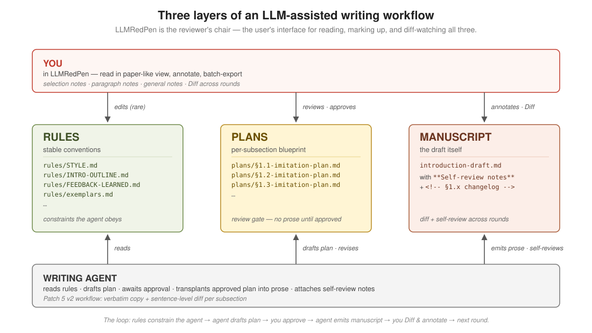

# LLMRedPen

A browser-based tool for reviewing long-form Markdown drafts an LLM
just wrote you. Read in a paper-like view, mark passages and paragraphs,
batch-export every comment to the model in one block, and watch — across
review rounds — exactly what the agent changed in response.

The aim is to bring the rhythm of paper review — careful reading, red-pen
margins, handover to the author, look at the revision, repeat — into
LLM-assisted writing, without turning the user into a full-time editor.



---

## Table of contents

- [Why this tool exists](#why-this-tool-exists)
- [The three-layer architecture](#the-three-layer-architecture)
- [Screenshots](#screenshots)
- [The review workflow](#the-review-workflow)
- [Folder layout the viewer expects](#folder-layout-the-viewer-expects)
- [The three tabs](#the-three-tabs)
- [Install &amp; run](#install--run)
- [Usage](#usage)
- [Hotkeys](#hotkeys)
- [Working with an LLM agent](#working-with-an-llm-agent)
- [What gets hidden from the reading view](#what-gets-hidden-from-the-reading-view)
- [How it works](#how-it-works)
- [Known limitations](#known-limitations)
- [Project layout](#project-layout)
- [License](#license)

---

## Why this tool exists

Working with LLMs on long-form writing has settled into a familiar loop:
paste a lot of text, get a lot of text back, scroll past most of it,
send the next message. The pile of unreviewed output snowballs. What
was meant to be a collaboration drifts into one party writing and the
other party tolerating.

The user isn't lazy. The reviewer's chair just isn't there.

**Markdown reads like a note, not a manuscript.** Heading hashes,
citation tokens, hard-wrapped lines, embedded comments — even rendered
in Typora or a VS Code preview, a Markdown draft feels like an informal
write-up, not a paper to focus on. There is no "I am reading a
manuscript" mode that invites careful reading.

**Markdown has no native annotation surface.** PDFs have margin
comments; Word has tracked changes; rendered HTML pages have
Hypothesis. Markdown — the *lingua franca* of LLM interaction — has
none of this. So reviewers fall back to writing remarks in a side file:
open a notepad, switch back and forth, copy-paste line numbers, lose
their place. The friction is high enough that most people stop after a
few comments and just tell the model to "make it better."

**Without batched feedback, every comment becomes a separate turn.**
Reviewers send the model one observation at a time as they read,
interrupting it mid-thought and re-running its context for each
fragment. The model edits a little, the user reads a little more,
sends another fragment. The conversation thrashes without ever
converging. One mistake in the model's output can also trigger a
wholesale rejection — the user discards the entire revision over a
single bad sentence and starts over, instead of pointing at the
specific line.

`LLMRedPen` tries to be the missing reviewer's chair. It renders a
Markdown file in a document-like reading view, lets you highlight any
passage or comment on any paragraph, then exports every comment as a
single block of plain text. You paste it back to the LLM in **one**
message — a real review pass, not a stream of interruptions. The next
time you open the file, the *Diff* tab shows what the agent did.

The deeper goal is to keep *you*, the human, reading what the LLM
wrote.

---

## The three-layer architecture

The viewer is built around how an LLM-assisted writing project actually
grows. There are three kinds of files involved, each playing a distinct
role in the loop (see the diagram at the top of this README):

### Rules — the constraints the agent obeys

Stable conventions that don't change per cycle. The agent reads them
on every turn as constraints; the user maintains them by hand. They
live under `rules/`:

- `STYLE.md` — banned phrases, register guidance, prose-level rules
- `INTRO-OUTLINE.md` — section-by-section structural spec
- `FEEDBACK-LEARNED.md` — running list of past mistakes the agent
  should avoid repeating
- `exemplars.md` — annotated reference passages the plan layer will
  imitate
- `literature-classification.md`, `paper-spec.md`, … — whatever else
  is project-wide

`CLAUDE.md` at the project root is also a rules file, special-cased
because the viewer can edit it in place via the rules editor (other
rules files are read-only from the viewer; you edit them in your
normal Markdown editor).

### Plans — the review gate before any prose is written

For each subsection the agent is about to draft, it **first** produces
a 4-part *imitation plan* and writes it to
`plans/§N.x-imitation-plan.md`:

1. **Target.** Which exemplar paragraph from `rules/exemplars.md` this
   subsection is modelled after.
2. **Verbatim copy.** The source paragraph quoted in full,
   sentence-by-sentence (`s1`, `s2`, …).
3. **Sentence-level diff.** For each source sentence: *transplant*
   (keep, with substitutions listed), *drop* (remove, with reason),
   or *new* (propose a sentence the source doesn't have — requires
   explicit author approval).
4. **Resulting draft.** The prose that would go into the manuscript
   if you approved as-is.

You review the plan in LLMRedPen, annotate where needed, and either
approve or send the agent feedback. Only after approval does the
agent commit prose to the manuscript. **This is the choke point.** It
catches fabrication BEFORE it lands in the draft, instead of after.

### Manuscript — the draft itself, with author-facing self-review

The actual prose, plus the agent's per-subsection self-review notes
(audited against the rules) and a small changelog HTML comment. Each
subsection follows this shape:

````md
### <descriptive title>

<prose paragraph(s) with @key citations>

**Self-review notes (C2.4 internal critic pass — surface to author):**

- **Qualifiers (fl-001).** ...
- **Causal connectors (fl-010).** ...
- ...

<!-- §N.x status: Draft N produced YYYY-MM-DD ... -->
````

When you open a manuscript file in LLMRedPen, the *Diff* tab shows
what changed since the previous round AND surfaces the agent's
self-review notes as a collapsible panel at the top. The reading view
automatically hides the self-review block + the changelog comment so
the prose flows uninterrupted (toggle *Show metadata* to see them).

### How the loop runs

```
1. You: "Draft §1.3 about X" (intent into the agent's chat).

2. Agent reads rules/ → drafts the imitation plan → writes it to
   plans/§1.3-imitation-plan.md → tells you it's ready.

3. You open the plan in LLMRedPen, read it, annotate or approve.

4. If you annotated: export the comments → agent → back to step 2.
   If you approved: the agent transplants the plan into the
   manuscript and attaches its self-review block.

5. You open the manuscript in LLMRedPen, click "Proceed to the next
   round" (or use Reload), then read the Diff tab — agent's
   self-review on top, textual diff below.

6. You annotate the manuscript, export, agent revises. When this
   subsection is good, you move to the next one and the cycle
   restarts at step 1.
```

The three layers aren't a strict pipeline — you'll bounce between
them. But the typical flow is: **rules stable** → **plan approved
then locked** → **manuscript iterated round by round**. The tool's
job is to make reviewing each layer feel like reviewing a paper, not
like scrolling through chat history.

---

## Screenshots

**The reading view**

A typical session: file picker + manuscript group on the left, the
rendered draft in the centre with `§S ¶N` paragraph markers in the
margin, comments stacked on the right.


<table>
<tr>
<td width="50%" valign="top">

**Annotating a paragraph**

Select any text → a popup opens, the selection stays alive (you can
still `⌘+C` to copy) while you decide whether to type a comment.
Engaging with the popup turns the selection into a permanent yellow
mark with a matching card on the right.


</td>
<td width="50%" valign="top">

**Batch export**

Every comment, in document order, in plain text. Copy to clipboard or
save as a file — one block to paste back to your LLM.


</td>
</tr>
</table>

**Editing tables in the CLAUDE.md rules file**

Tables inside the writing-rules file are typically the worst part of
Markdown editing — pipe characters, alignment hyphens, hand-counting
columns. Hover any rendered table in the rules editor to reveal an
*Edit table* button; click it to drop into a visual grid where each
cell is an auto-growing textarea. Apply turns the grid back into clean
Markdown table syntax.


---

## The review workflow

One iteration with a writing agent is one *round*. The tool models the
loop explicitly:

```
  Round N
  ───────
  1. Read the file in the Current tab.
  2. Annotate as you go — text selections, paragraph notes,
     general notes.
  3. Click Export → Copy → paste into your agent's chat,
     together with "apply these comments to <file>".
  4. The agent edits the file on disk.
  5. Click "Proceed to the next round". The file + your comments
     are snapshotted into Prev. The file is re-read from disk into
     Current. The Diff tab lights up with the agent's changes.

  Round N+1
  ─────────
  6. Scan Diff to see what the agent did, with the agent's own
     per-subsection self-review notes shown above the textual diff.
  7. Skim Prev to compare what you wrote against what was produced.
  8. Annotate the new Current. Back to step 3.
```

Only the previous round is kept. Promoting again overwrites it — the
tool isn't a version-control system, and isn't trying to be. If you
need a paper trail across many rounds, *Save as file…* in Export
writes that round's comments to a `.txt` you can archive yourself.

---

## Folder layout the viewer expects

Point the viewer at any folder of `.md` files. A typical paper layout:

```
paper/
├── CLAUDE.md                 ← project rules (the one file the tool can edit)
├── introduction-draft.md     ← root files = manuscript, get the round model
├── ...
├── manuscript/               ← (alternative) manuscript files in a subfolder
│   └── introduction-draft.md
├── plans/                    ← writing agent's per-subsection plans
│   └── §1.x-imitation-plan.md
├── rules/                    ← style guides, spec files, outline docs
│   ├── STYLE.md
│   ├── INTRO-OUTLINE.md
│   └── FEEDBACK-LEARNED.md
└── self-review/              ← agent's per-round audit notes
    └── round-3-notes.md
```

The sidebar shows each top-level subfolder as its own labelled group
(`plans/` → "Plans", `self-review/` → "Self-review", etc.). Nested
folders are walked recursively to a few levels — so
`manuscript/plans/foo.md` appears under the *Manuscript* group with a
`plans/foo.md` relative label.

**Auto-hidden folders** (never enumerated): `docs/`, `latex/`,
`archive/`, `node_modules/`, and anything dotfile-style (`.git/`,
`.cache/`, …). Edit the `IGNORED_FOLDERS` set near the top of
`app.js` to add or remove names.

**Two treatment levels** for the files that *are* shown:

| Treatment | Where | Tab bar | Proceed button | Annotate / Export | Reload |
|---|---|---|---|---|---|
| Full (round model) | Root `.md` files + anything under `manuscript/` | Prev / Diff / Current | yes | yes | yes |
| Half | Files in any other subfolder (`plans/`, `rules/`, `self-review/`, …) | Current only (tabs hidden) | no | yes | yes |

Half-treatment fits files that don't iterate the way the manuscript
does — plans written once per subsection, rules you maintain by hand,
self-review notes produced per round. They're still annotatable and
still exportable; they just don't carry a "previous round" of their
own. The `manuscript/` subfolder is special-cased so you can keep
your drafts there for tidiness without losing the round model; if you
use a different folder name for the manuscript itself, add it to
`MANUSCRIPT_FOLDERS` near the top of `app.js`.

---

## The three tabs

When you open a root manuscript file:

| Tab | Shows | Editable |
|---|---|---|
| `← Prev` | The file + your comments from the previous round | no — frozen archive |
| `↔ Diff` | Word-level diff between Prev and Current, plus the agent's per-subsection self-review notes at the top | no — read-only |
| `Current →` | The current file content + this round's in-progress comments | yes |

*Prev* and *Diff* are disabled on the first round (no baseline exists
yet). Clicking *Proceed to the next round* creates the first baseline.

When you open a subfolder file, the tab group is hidden — only the
editable Current view shows, with *Reload* and *Show metadata* still
available.

The *Diff* tab also surfaces the writing agent's
[**self-review notes**](#what-gets-hidden-from-the-reading-view) when
they're present in the source: one collapsible row per `###`
subsection, with an *Expand all* / *Collapse all* toggle. The agent's
narration of *why* it made the changes sits visually above the textual
diff of *what* actually changed.

---

## Install &amp; run

Requires a Chromium-based browser (Chrome / Edge / Arc / Brave) for the
[File System Access API](https://developer.mozilla.org/en-US/docs/Web/API/File_System_Access_API),
and [Bun](https://bun.sh) to serve the static page. There is no backend.

```sh
git clone https://github.com/rqhu1995/LLMRedPen.git ~/tools/llm-redpen
bun ~/tools/llm-redpen/server.ts
```

Then open <http://localhost:5173/>.

Optional shell alias — for fish:

```fish
# add to ~/.config/fish/conf.d/03-aliases.fish (or your shell config)
alias redpen='bun ~/tools/llm-redpen/server.ts'
```

---

## Usage

1. **Open a folder.** Click *Open paper folder…* and pick any
   directory containing `.md` files. Nothing on disk is touched except
   `CLAUDE.md` (and only when you explicitly save the rules editor).
   `CLAUDE.md` doesn't have to exist up front — the editor will offer
   to create it.
2. **Pick a file from the sidebar.** Root files appear under
   *Manuscript* (or *Top level* if you also have a literal
   `manuscript/` subfolder); each subfolder becomes its own group.
3. **Read.** Each paragraph gets a `§S ¶N` anchor in the margin.
4. **Annotate** in any of three modes:
   - Select text → comment popup → `⌘+Enter` to save. Selecting
     doesn't steal focus; you can `⌘+C` to copy if you only wanted
     the text. Click anywhere outside the popup to dismiss it.
   - Click a `§S ¶N` margin label → comment popup pre-anchored to
     that paragraph.
   - Click *+ Add note* in the right pane → unanchored remark.
5. **Navigate.** Hover a `mark` in the article to see the comment in
   a tooltip and highlight the matching card on the right; click
   either side to scroll the other.
6. **Export.** *Export…* in the right pane gives you the full batch
   as plain text, with a scope toggle (*This file* vs *All files in
   this folder*) and a *Copy to clipboard* / *Save as file…* footer.
7. **Hand off** to your agent (see [Working with an LLM agent](#working-with-an-llm-agent)).
8. **Proceed.** When the agent has edited the file on disk, click
   *Proceed to the next round*. Diff lights up with what changed;
   Prev shows what you sent.

### Reload from disk vs. Proceed

`↻ Reload` re-reads the current file from disk without refreshing the
whole page — useful for checking "is the agent done editing yet?"
while you keep your session state intact. If the disk version differs
from what you've been annotating AND you have unfinished comments,
a safety dialog appears with three choices:

- **Lock this round, then load the new version** *(default)* — equivalent
  to clicking Proceed first. Your comments + the version you saw become
  the new Prev; the new file becomes Current; Diff shows what changed.
- **Discard my comments and load the new version** — use this if your
  current-round comments are no longer useful and you just want to start
  fresh against the new file.
- **Cancel** — don't touch anything.

This means you can never silently lose a round by forgetting to click
Proceed before the agent edits the file.

### Clearing comments

*Clear comments…* (next to Export) opens a small modal with a scope
radio that spells out comment counts:

> ◉ Comments on "intro.md" (3 comments)
> ○ Comments in every file (12 comments)

Single *Delete* button. Pulled out of the Export modal on purpose, so
the destructive action lives somewhere distinct from the output action.

---

## Hotkeys

| Key | Action |
|---|---|
| `⌘+Enter` (in comment popup) | Save the comment |
| `Esc` | Cancel popup / close modal |
| `⌘+E` | Open the export modal |
| `Tab` / `Shift+Tab` (in table editor) | Move between cells |

> Windows / Linux users: read `⌘` as `Ctrl` throughout — the UI labels
> are rewritten automatically on non-Mac platforms.

---

## Working with an LLM agent

Two prompts live in `docs/`:

- [**`docs/agent-prompt.md`**](docs/agent-prompt.md) — paste this with
  each batch of exported comments. Explains the `§S ¶N` anchor scheme
  so the agent can locate each comment in the source. **The anchors
  are NOT in the source file** — they're a viewer-side display
  computed from structural position, so the agent needs the rule.
- [**`docs/agent-workflow.md`**](docs/agent-workflow.md) — paste this
  *once* when bootstrapping the agent session. Sets the
  `plans/<...>-imitation-plan.md` file convention and the metadata
  formatting constraints the viewer's stripper expects (HTML comments,
  leading blockquote, `**Self-review notes` block).

A round-N handoff to the agent looks like:

```
[Annotation anchor format prompt from docs/agent-prompt.md]

[Your exported comments block]

Please apply these comments to introduction-draft.md.
```

The agent edits the file on disk → you come back to the viewer → click
*Proceed to the next round* (or use *Reload* with its safety dialog) →
the Diff tab now shows the agent's revisions.

---

## What gets hidden from the reading view

Drafts commonly carry metadata that isn't body prose. The viewer strips
it before rendering so the reading view stays clean AND the `§S ¶N`
paragraph numbering counts only real paragraphs:

| Pattern | Example | When stripped |
|---|---|---|
| Leading blockquote (top of file) | `> Working draft. Accumulates one approved §1.x...` | always |
| HTML comment | `<!-- §1.3 status: Draft 2 produced ... -->` | always |
| Self-review notes block | `**Self-review notes (...):**` + bullet list | always |

The *Show metadata* toggle in the tab bar reverses the strip when you
want to see what was hidden. The setting persists across sessions.

The self-review block is **also** surfaced in the *Diff* tab (regardless
of the toggle), one collapsible row per subsection, so the agent's
narration sits next to the textual changes you're reviewing.

The literal `**Self-review notes` prefix is the contract with the
writing agent — see `docs/agent-workflow.md`. If the agent renames the
block (`**Internal critique:**`, etc.), the stripper can't find it and
the bullets leak into the reading view.

---

## How it works

- **Browser-first.** Static page (`index.html`, `app.js`, `style.css`)
  served by a ~50-line Bun static server (`server.ts`). All file I/O is
  client-side through the File System Access API. The server has no
  knowledge of your manuscript.
- **Persistent annotations.** Current-round comments live in
  `localStorage` keyed by folder name (`mda:<dir>`). The previous-round
  snapshot lives in `mda:baselines:<dir>` as `{content, annotations,
  timestamp}` per file. The directory handle lives in `IndexedDB`
  (DB `mda`, store `handles`, key `lastFolder`) so a refresh restores
  the folder *and* auto-reopens the last file you had open.
- **Round model, not a VCS.** *Proceed to the next round* snapshots the
  current file content + this round's comments into a single
  previous-round slot, then re-reads the file from disk so Current
  reflects the agent's latest edit. Only one prior round is kept;
  promoting again overwrites it.
- **Diff.** Word-level inline diff via
  [jsdiff](https://github.com/kpdecker/jsdiff). Operates on the
  markdown source (not rendered HTML) so the user sees actual textual
  changes including markdown-structure edits like added headings. With
  metadata hidden, the diff strips metadata from both sides too, so it
  stays focused on prose changes.
- **Annotation locator (internal).** Highlights for current-round
  comments are placed by a four-layer locator (structural anchor →
  character offset → exact context → fuzzy context, modelled on
  [Hypothesis](https://github.com/hypothesis/client)). It's there to
  survive small mid-session edits. Comments that fail to locate just
  don't draw a highlight; their cards still show in the right pane.
- **Dependencies.** markdown-it, KaTeX, jsdiff from CDNs. No `npm
  install`, no build step. Bun is only the static file server.

---

## Known limitations

- **Same quote, multiple occurrences.** If the selected text and its
  prefix/suffix appear in more than one place in the file, the locator
  picks the candidate closest to the stored character offset; without a
  position hint it picks the first hit.
- **Whole-paragraph rewrite mid-round.** If the agent rewrites a
  passage past the point where the locator can find it, the comment's
  highlight doesn't render — but the card still shows in the right
  pane with the stored quote. The intended workflow is *Proceed*
  before the agent edits, so each round's comments stay paired with
  the version they were written against. The Reload safety dialog
  catches the common "I forgot to Proceed" case.
- **One prior round only.** Promoting again overwrites the previous
  baseline. If you need a paper trail across many rounds, save each
  round's exported comments to a `.txt` and keep them yourself.
- **Annotations live in your browser.** Clearing `localStorage` for
  `http://localhost:5173`, switching browsers, or wiping the profile
  drops them. *Save as file…* in Export is the portable backup path.
- **Edits to files other than `CLAUDE.md` are out of scope.** Use your
  normal Markdown editor (or have the agent edit the file directly)
  for everything else. This tool is the reviewer's chair, not the
  author's chair.

---

## Project layout

```
llm-redpen/
├── server.ts                 # ~50 lines, Bun static server
├── index.html                # page skeleton + all modals
├── app.js                    # all browser logic
├── style.css                 # styles
├── favicon.svg               # red-pen-on-yellow icon
├── docs/
│   ├── agent-prompt.md       # per-batch prompt: §S ¶N anchor format
│   ├── agent-workflow.md     # one-time setup: plans/ + metadata rules
│   └── screenshots/
└── README.md
```

---

## License

MIT.
